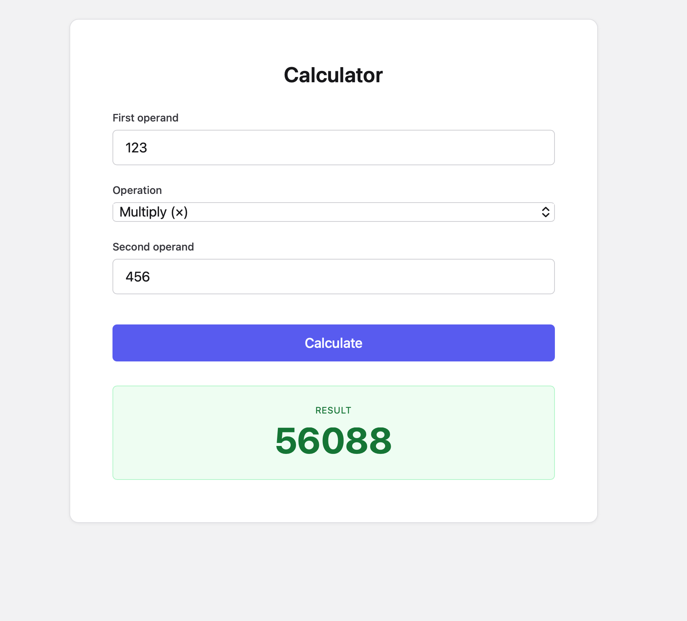

# Calculator

Small full-stack calculator built with Go (`net/http`) and React + TypeScript.



## Overview

The project is intentionally narrow in scope:

- four operations: add, subtract, multiply, divide
- one calculation endpoint: `POST /api/v1/calculations`
- one health endpoint: `GET /health`
- backend-enforced operand limits via `CALC_MIN` / `CALC_MAX`
- matching frontend validation defaults via `VITE_CALC_MIN` / `VITE_CALC_MAX`

Primary references:

- `specs/calculator/requirements.md` — scope and acceptance criteria
- `api/openapi.yaml` — canonical API contract
- `specs/calculator/api.md` — human-readable API guide
- `specs/calculator/plan.md` — historical phased implementation plan used
  during the AI-assisted development process
- `backend/README.md` — backend usage and behavior
- `frontend/README.md` — frontend usage and behavior

## AI-Assisted Development

This repository was developed with AI assistants.

The workflow was intentionally spec-driven:

- define requirements and API contract first
- break implementation into explicit phases
- use AI to help plan, implement, review, and refine each phase
- keep all outputs manually reviewed and aligned to the repo contract

The two main process artifacts are:

- `specs/calculator/plan.md` — the phased execution guide used during
  development
- `docs/ai-prompts.md` — archived representative prompts preserved from
  that workflow

## Run

Prerequisites:

- Go 1.25+
- Node.js 20+
- npm
- Docker with Compose v2 for containerized usage

Local development:

```sh
make setup
make run
```

- backend: `http://localhost:8080`
- frontend: `http://localhost:5173`

Docker Compose:

```sh
make up
make down
```

- frontend: `http://localhost:80`
- API requests to `/api/` are proxied to the backend by the frontend image

## API

Quick example:

```sh
curl -s -X POST http://localhost:8080/api/v1/calculations \
  -H 'Content-Type: application/json' \
  -d '{"op":"divide","a":10,"b":3}'
```

```json
{
  "result": 3.3333333333333335
}
```

Error shape:

```json
{
  "error": {
    "code": "DIVISION_BY_ZERO",
    "message": "division by zero is not allowed"
  }
}
```

Validation notes:

- malformed JSON, extra fields, and trailing payloads return `400 INVALID_REQUEST`
- missing `op`, `a`, or `b` returns `400 MISSING_FIELD`
- unsupported operations return `400 INVALID_OPERATION`
- division by zero returns `422 DIVISION_BY_ZERO`
- configured operand-limit violations return `422 OPERAND_OUT_OF_RANGE`

## Make Targets

```sh
make help
```

| Target | Description |
| --- | --- |
| `make setup` | Bootstrap local environment (tools + dependencies) |
| `make backend.setup` | Install backend tooling and download Go module dependencies |
| `make frontend.setup` | Install Node dependencies (`npm ci`) |
| `make run` | Run backend and frontend locally in parallel |
| `make test` | Run all tests |
| `make coverage` | Run all tests with coverage reports |
| `make lint` | Run all linters |
| `make format` | Auto-fix lint issues |
| `make build` | Build backend binary and frontend assets |
| `make clean` | Remove build artifacts |
| `make docker.build` | Build both Docker images |
| `make up` | Start the full stack with Docker Compose |
| `make down` | Stop the full stack |

Per-service targets are documented in `backend/README.md` and `frontend/README.md`.

## Project Structure

```text
backend/    Go API server
frontend/   React + TypeScript UI
api/        OpenAPI contract
docs/adr/   Architecture and tooling decisions
specs/      Requirements, API guide, and implementation plan
```

## Design Summary

- business logic lives in `backend/internal/calculator`, separate from HTTP handling
- frontend API calls are isolated in `frontend/src/api/`
- validation happens on both sides, with the backend as the source of truth
- Docker images are multi-stage and self-contained
- CI runs lint, test, and build through the documented Make targets

## Documentation Notes

The repo also includes historical process and design artifacts:

- `docs/adr/0001-architecture-and-api.md`
- `docs/adr/0002-tooling-and-delivery.md`
- `docs/adr/0003-frontend-architecture.md`
- `docs/adr/0004-environment-variables-for-configuration.md`
- `specs/calculator/plan.md`
- `docs/ai-prompts.md`
